# App’s Auto-Login Function Security Testing via Android OS-Level Virtualization

>作者：Wenna Song1, Jiang Ming2, Lin Jiang3, Han Yan1, Yi Xiang1, Yuan Chen1, Jianming Fu1 and Guojun Peng1
>
>单位：1Wuhan University（武汉大学）, 2The University of Texas at Arlington（德州大学阿灵顿分校）, 3Independent Researcher
>
>会议：ICSE 2021
>
>论文链接：[App’s Auto-Login Function Security Testing via Android OS-Level Virtualization](http://arxiv.org/pdf/2103.03511)

## ABSTRACT

现如今的许多移动平台app都支持**自动登录（automatic login）**，允许用户在再次打开app时，不需要重新输入登录凭证，就能完成登录认证。app的这种认证功能，通常是通过**存储在用户手机上的凭证数据**和**设备一致性检测**来实现的，因此容易受到**数据克隆攻击（data-clone attack）**。这种攻击的威胁主要是可以**突破付费用户限制（break through the paying-subscriber limit）**，即突破app限制的，同一时刻登录同一账户的最大设备数量。

本文对来自**Google Play** 和**华为/小米应用市场**的**234 个**热门安卓app进行了测试。作者发现：

- 借助常规的**设备制造商手机克隆应用（OEM-made phone clone app）**，可以实现对其中**131个app**的数据克隆攻击；其余的103个app采取了一定的保护措施，进行了**设备一致性检查（device-consistency check）**。
- 借助**Xposed** 框架的API hooking功能编辑设备属性（device attributes）之后，可以对**148个app**实施数据克隆攻击。也就是说，有17个app的设备一致性检查能轻易地被用户级APIhooking方法所规避。
- 作者基于**Cells**平台开发了**VPDroid（Virtual Phone on Android）**手机模拟平台。VPDroid平台是一个透明的设备属性编辑平台，允许用户定制虚拟手机的设备属性，且虚拟手机的性能与主机性能相差不大。利用VPDroid，可以在非root设备上，对**所有的234个app**实施数据克隆攻击。

<!-- more -->

## 1. BACKGROUND AND RELATED WORK

### 1.1 Automatic Login in Mobile Apps

大多数自动登录方案，会在设备本地存储凭据数据，并凭此自动完成与app服务器间的身份验证。 

凭据数据通常存储在**“/data/data/[app name]/”**这个内部存储目录（私有目录）下，其他app一般无权访问该目录。

以微信为例，微信app的认证凭据数据存储在**“/data/data/MicroMsg/”**目录下，主要存储在**“/data/data/MicroMsg/[xxxx...xxxx]/EnMicroMsg. db”**、**“/data/data/MicroMsg/systemInfo.cfg”**及其他若干文件中。其中**“xxxx...xxxx”为一个文件名的32位md5值**。

但是，即使我们将旧手机中**“/data/data/MicroMsg/”**下的所有数据都克隆到新手机上，仍无法在新手机上自动登录微信。因为微信app会检测到**智能手机环境的变化**，具体而言，微信app会检测包括IMEI 、蓝牙地址在内的22个设备特征。在本文的数据集中，共有103个app进行了这种**设备一致性检查（device-consistency check）**。

### 1.2 OEM-Made Phone Clone Apps

**手机制造商**（Original Equipment Manufacture）的手机克隆应用（OEM-made phone clone apps）有权调用Android的**Backup API**，在**同一制造商的非root手机**之间传输**“/data”**分区中的应用私有数据。这一功能原本应被用于设备更换时，却给数据克隆攻击带来了便利。

### 1.3 Paying-Subscriber Fraud

一些app限制同一账户同时登录的最大设备数量，例如，**Netflix**限制，每个付费账户最多同时在四个设备上登录。而用户可以通过**data-clone attack**，突破这种限制，具体过程如下所示：

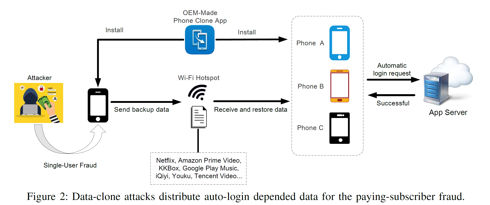

对攻击者的能力的假设：攻击者可以完全控制受害者设备。

这里要提到的是，经过作者的检验，对一些app而言，通过**automatic login**方式完成的登录，并不会改变app服务器端对已登录设备的计数，即便原手机和新手机与app服务器端交互时的网络IP等信息是不同的。这可能是因为，app服务器端认为，原手机和新手机与app服务器端的连接是两个并行的会话。

## 2. Data-clone attack

### 2.1 Assumption

攻击者如何收集受害者的数据以发动攻击？

- 攻击目标：绕过账户登录验证
  - 假设1：攻击者可以**物理访问受害者的** **root 设备**，或在受害者的root设备上安装恶意软件
    - 腾讯研究表明，80% 的中国用户拥有 root 设备 [25]
  - 假设2：用户的设备没有root，攻击者利用**phone-clone app的漏洞**拦截用户的私人数据
    - CVE-2019-15843，ACSAC’20 [34]
- 攻击目标：实现订阅欺诈
  - 假设：攻击者可以完全控制受害者设备，通过root设备，或者使用OEM-Made Phone Clone Apps来克隆数据

### 2.2 Experiments with Most-Downloaded Apps

作者使用的旧手机是Xiaomi Redmi Note 4，新手机是Huawei Honor 8。

作者从 **Google Play** 获得了 **114** 个热门安卓app，从**华为/小米应用市场**获得了 **120** 个热门安卓app，然后使用OEM-made phone clone app对这些app在手机间进行数据迁移。经过数据迁移之后，234个app中有131个app可以在新手机上成功被登录。

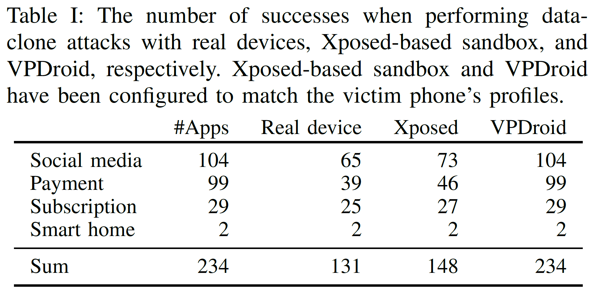

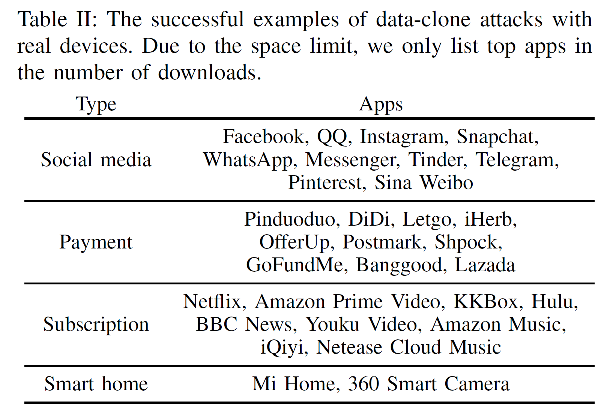

### 2.3 Device-Consistency Check

**其余的103个app**出现了以下响应之一：

1）程序终止并退出；

2）程序要求用户再次输入 ID 和口令。

作者猜测这些app很可能已经检测到了手机环境的变化。

作者利用设备属性编辑工具（device-attribute editing tool） **XxsqManager**（基于Xposed框架），通过API hooking编辑新设备的属性，让其保持与旧设备相同。 在这种情况下，**又有17个app**可以在新手机上成功被登录，如下所示：

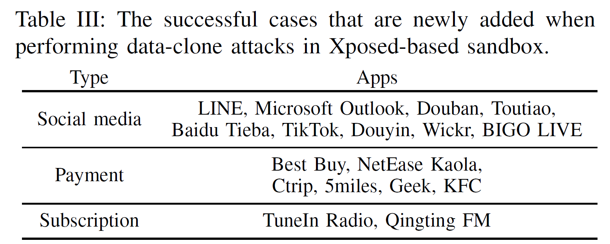

剩余的一些app，例如支付宝、Apple Music等，可以检测到Xposed框架的存在。作者在下文中通过操作系统虚拟化的方法，进一步研究针对这些app的数据克隆攻击方案。

## 3. VPDROID SYSTEM DESIGN

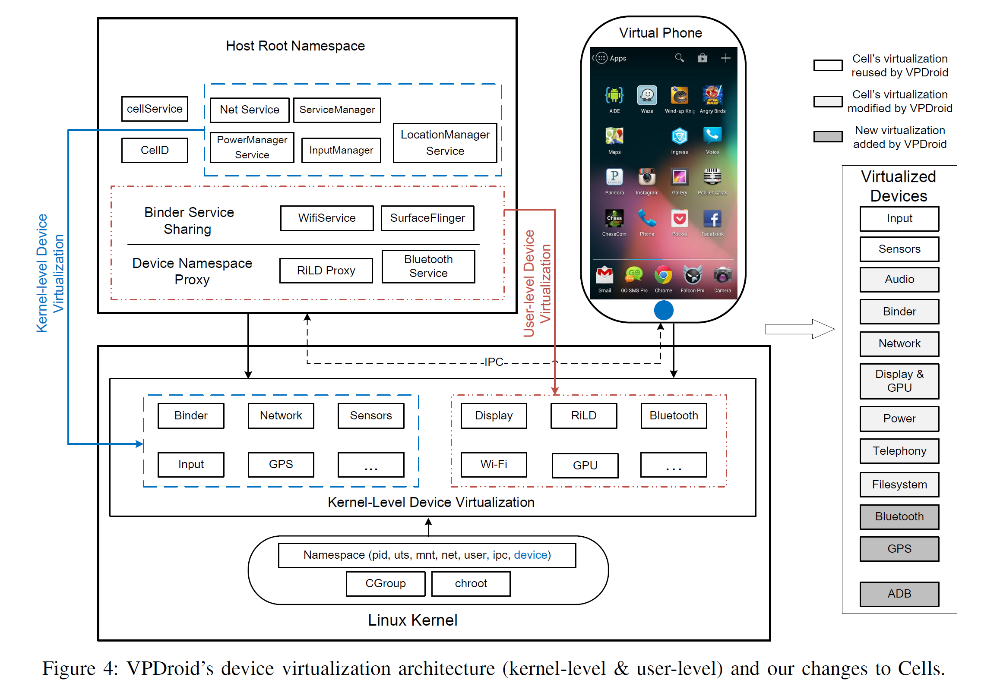

作者提出的VPDroid系统是基于 **Cells** 虚拟化系统实现的。Cells是第一个在单个 Android 设备上**运行多个隔离的virtual phone (VP)**的轻量级的**操作系统级虚拟化**系统。

作者对Cells的改进集中在两个方面：

1）实现了一种新的用户级设备虚拟化方案（New User-Level Device Virtualization）

​		这种方案能实现更好的透明度和可移植性

2）允许使用者自定义VP的设备属性（Customize The Vp’S Device Attributes）

​		Cells 不是为了编辑设备属性而设计的

## 4. NEW USER-LEVEL DEVICE VIRTUALIZATION

作者对VPDroid的实现中，采用了两种虚拟化方法：**Binder Service Sharing**和**Device Namespace Proxy**。在VPDroid中，对WiFi配置和Telephony功能的虚拟化，分别采用了这两种方式。

### 4.1 Binder Service Sharing: WiFi Configuration

针对在ServiceManager中注册过的service

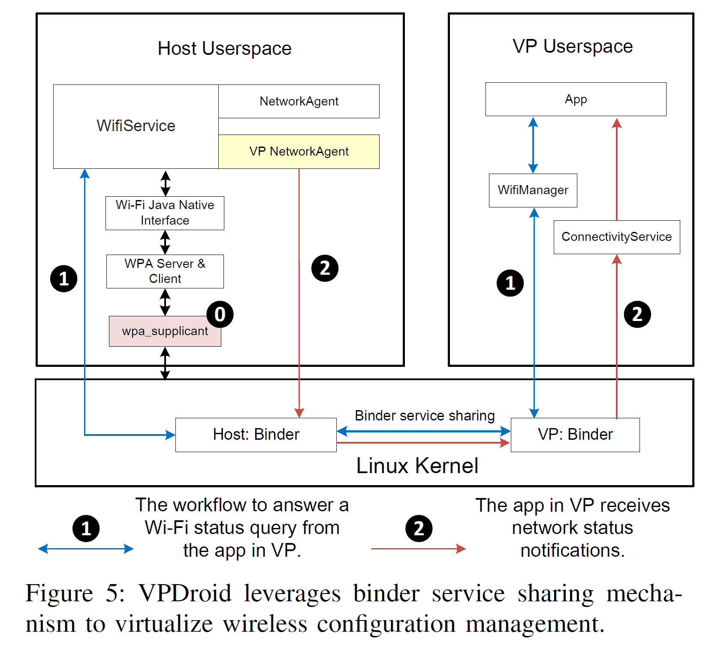

**Binder 是 Android 中的进程间通信（IPC）机制。**

作者使用 Binder 服务共享机制，在 VP 和Host之间共享 WifiService。上图中的**蓝色双向线**代表Host**响应 VP 应用程序的WiFi 状态查询**的工作流程，**红色双向线**代表Host**自动将网络状态通知转发给VP的流程**。

### 4.2 Device Namespace Proxy: Telephony

针对未在ServiceManager中注册的service

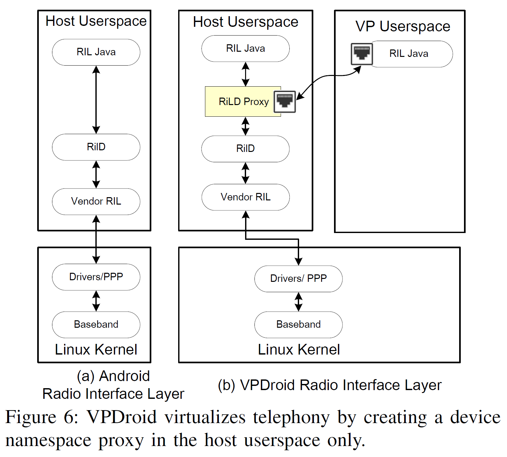

在主机的Radio Interface Layer，作者在 **RILJ**（位于application framework层的一个API）和 **RilD** （位于Libraries层的一个daemon，用于处理调制解调控制请求）之间创建了一个名为 **RiLD** 的代理，并在该代理中创建了两个socket， 一个socket**连接到** **VP 的 RILJ**，另一个socket**连接到Host系统的RILJ**。 

## 5. CUSTOMIZE THE VP’S DEVICE ATTRIBUTES

VPDroid系统允许使用者定制VP的属性，作者将这些属性分为三类：**Android system properties**、**user-level-virtualized device properties** 和 **kernel-level-virtualized device properties**。用户预先在配置文件**“build.VPDroid.prop”**中保存这些属性。对不同的属性，VPDroid系统有不同的定制方法，其整体结构如下：

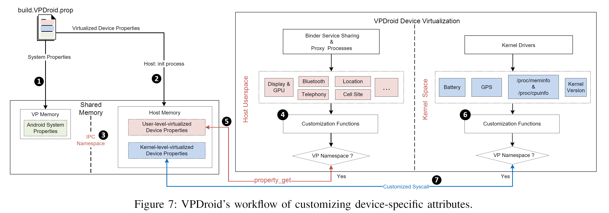

- **Android System Properties**： 如brand、Serial Number、 IMEI、Android ID等，均为常量值，用于描述手机的配置信息。在 VP 启动时，VPDroid**强制 VP 的 init 进程**将用户预先给出的 **Android System Properties**从“build.VPDroid.prop”加载到 VP 的**共享内存空间**中。

- **User-Level-Virtualized &  Kernel-Level-Virtualized Device Properties**
 VPDroid首先检查associated device namespace，来确定当前的请求是来自 VP 还是来自Host。

 如果来自VP：

 - 对于User-Level Customization，调用“property get”从Host共享内存中获取数据，然后将数据返回给VP；
 - 对于Kernel-Level Customization，由于加载到init进程中的数据没有进入内核空间的权限，因此作者创建了一个新的系统调用，用于将数据从用户空间复制到内核空间。

VPDroid 可以模拟 101 种安卓设备的环境配置。

## 6. VPDROID EVALUATION

### 6.1 Performance Measurements

这部分实验对VPDroid中VP的性能进行评估。

- 所使用的设备包括：
  - **Google Nexus 6p-1**（ARM Cortex-A53、Adreno 430 GPU、3G RAM 和 32G ROM）
  -  **Google Nexus 6p-2**（ARM Cortex-A57、Adreno 430 GPU、3G RAM 和 64G ROM）
- 所设置的场景包括：
  - 无背景音乐
  - 有背景音乐

- 所选取的benchmark app包括：
  -  Linpack (v1.1)：侧重测试CPU性能
  - Quadrant advanced edition (v2.1.1)：侧重测试2D图像和文件I/O相关性能
  -  3DMark (v2.0.4646)：侧重测试3D图像相关性能
  - SunSpider (v1.0.2)：侧重测试网页浏览性能
  - BusyBox wget (v1.21.1)：侧重测试联网性能（测试过程是通过Wi-Fi 热点下载一个 409M 的视频文件）

测试结果如下：（图 8(a) 至 图 8(d) 经过了标准化，展示了VP在时耗方面的overhead）

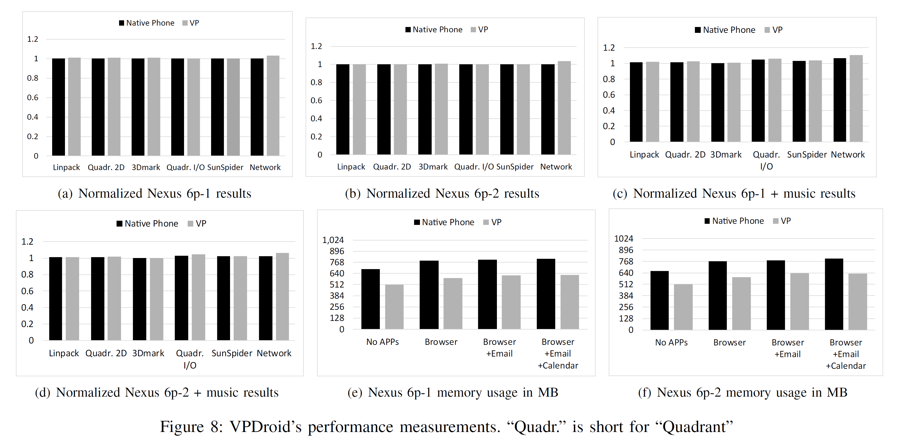

其中，如**图 8(e) 和图 8(f)**所示，VP 的内存使用量少于Host，这是因为VP的kernel service的主存消耗都发生在了Host设备上。

### 6.2 Virtualization-Assisted Data-Clone Attack

这部分实验对基于VPDroid的data-clone attack的可行性进行了评估。

实验中使用的真实设备是**Google Nexus 6p-2**。在其上，作者将**VP环境分别配置为Xiaomi Redmi Note 4、Redmi Note 4x、Huawei Honor 6x、Honor 8 和 Google Nexus 6P-1**。

经过实验，作者设计的攻击方案，针对全部的234 个app，均可完成数据克隆攻击。

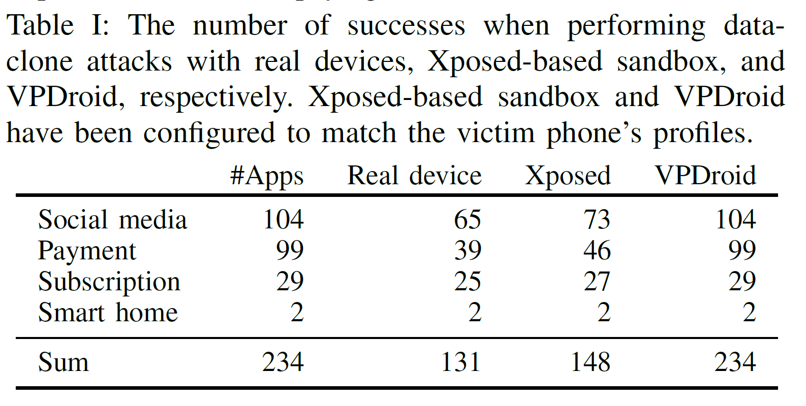

涉及到的相关漏洞如下

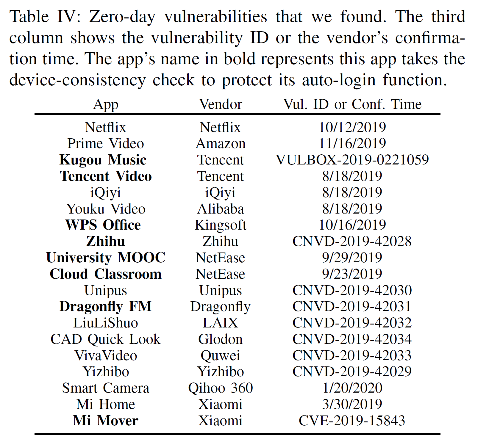
